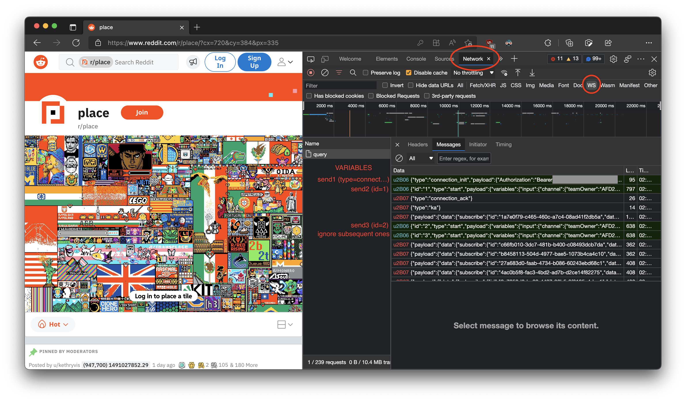

# R/Place Archiver

This tool will download a full copy of the Reddit r/place canvas upon execution, and will continously download all changes that occur as long as it is running (at multiple requests per second).

**Instructions (for Ubuntu)**

1. Run this in terminal
```
sudo apt update && sudo apt upgrade

# Install NodeJS 16.x LTS
curl -fsSL https://deb.nodesource.com/setup_lts.x | sudo -E bash -
sudo apt-get install -y nodejs

sudo apt install zip unzip
```
2. Navigate to the Reddit r/place website
3. Open Developer Tools, click on the Network tab, and then on the "WS" option as indicated in the screenshot below:

4. Copy the first green request (a websocket send, labeled by "send1") into `var send = [text here]` in `main.js`
5. Do the same thing for send2 and send3, no more text is needed.
6. Set the directory to where you want to store the output (In my case it's in `/data/`), make sure it has decent random write because there could be hundreds of thousands of files
7. run `node main.js` to start!
